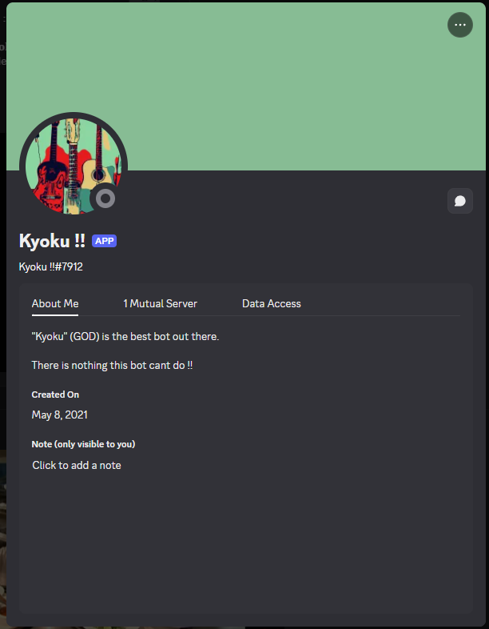

# Kyoku !! – Discord Music Bot 🎵

Kyoku is a fully functional music bot built with `discord.py`, capable of joining voice channels, playing YouTube songs, handling queues and supporting basic commands like play/pause/skip. Designed for seamless and chill Discord music sessions with friends.

> "Kyoku (GOD) is the best bot out there. There is nothing this bot can't do!!" It's Silly I know but I was 16 atp.

## ✨ Features
- Add songs using simple text commands (e.g. `:p [song name]`)
- Queue and view upcoming songs
- Play, pause, and skip functionality
- Auto search & stream audio from YouTube
- Show currently playing track with thumbnail

## 🤖 Commands Overview
| Command | Action |
|---------|--------|
| `:p [song]` | Plays or queues a YouTube song |
| `:q`       | Shows the current queue |
| `:song`    | Displays the currently playing track |
| `:skip`    | Skips to the next track |
| `:pause`   | Pauses playback |
| `:resume`  | Resumes playback |

## 🚀 Tech Stack
- `Python`
- `discord.py`
- `youtube_dl` or `yt_dlp`
- `ffmpeg`

## 📂 Files
- `kyoku.py` — The main bot logic (commands, queue, playback)
- `requirements.txt` — Python dependencies
- `.env` — Bot token + environment config (not included in repo)
- `media/` — Screenshots of Kyoku in action

## 🔧 Installation
```bash
git clone https://github.com/Kemono72/kyoku-discord-bot
cd kyoku-discord-bot
pip install -r requirements.txt
```
Make sure you have `ffmpeg` installed and set your token in a `.env` file:
```env
DISCORD_TOKEN=your_token_here
```

### 📸 Media

- **Kyoku Bot Profile & Commands**
  

- **Queueing Songs & Playback**
  

- **Embedded Song Queue**
  

## 📚 Inspiration
This project started in 2021 when musicbots were dissapering as a way to explore Discord bots, music streaming APIs and build a tool so friends could vibe with. It became my first bot that felt alive and rare at the time queueing bangers and keeping the server lit.

## ⚖️ License
MIT License

---

💻 Built by [@Kemono72](https://github.com/Kemono72) for fun, vibes and curiosity.
